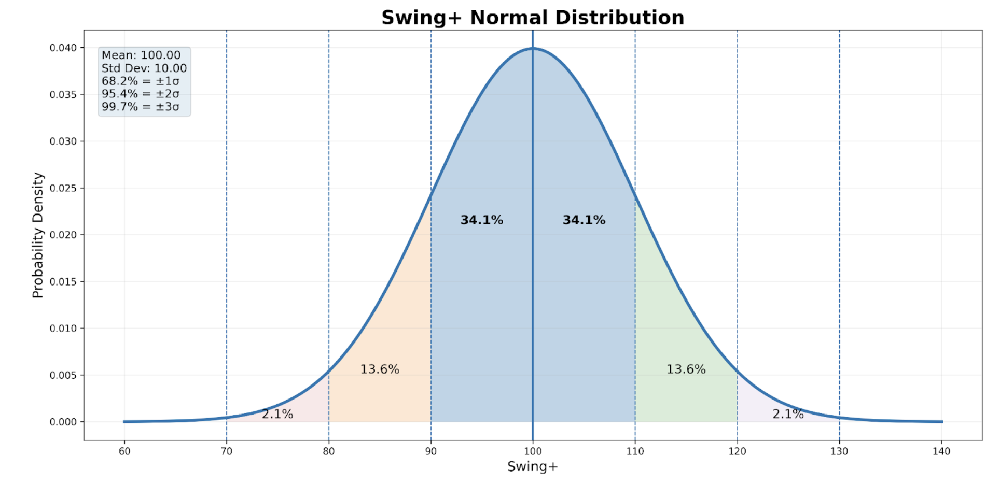
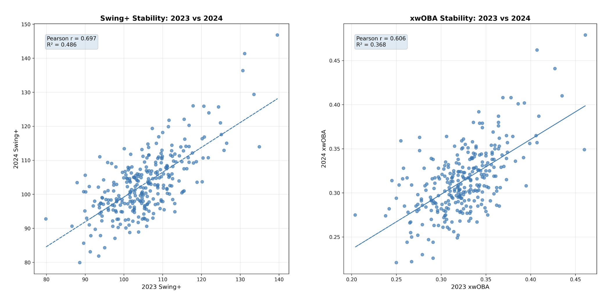
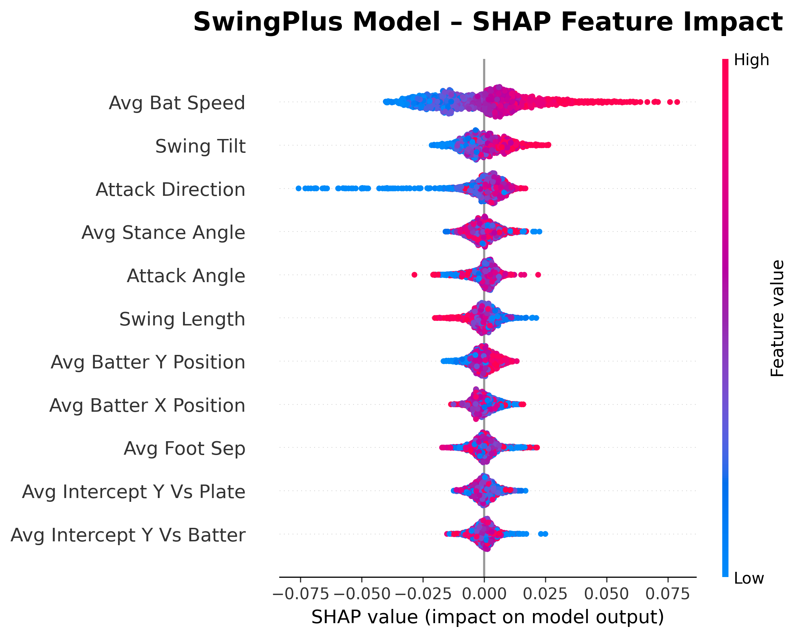

# Introducing Swing+, BatToBall+, and Impact+

**By Victor Martinez**

[Project Link](https://swing-plus.streamlit.app/)  
[Project Github Link](https://github.com/vmart45/swing_plus)

## Introduction

Swing+, BatToBall+, and Impact+ were created to answer a question I had always found myself coming back to: what actually makes a good swing, and why are good swings good? In baseball, the term "good swing" is often thrown around loosely, praised in the moment but rarely defined with any real precision. Is it about bat speed? Barrel control? Timing? Or something more subtle that only elite hitters consistently achieve?

Traditional stats tell us what happened after contact, but they fail to explain the quality of the movement that produced it. These metrics were designed to shift the focus from outcome to process, to isolate, measure, and quantify the individual components that create an efficient, repeatable, and dangerous swing. By breaking the swing down into measurable elements such as decision-making, precision of contact, and the quality of bat-to-ball interaction, Swing+, BatToBall+, and Impact+ provide a clearer lens through which we can evaluate hitters beyond surface-level results.

The goal is not simply to label swings as good or bad, but to understand the traits that separate elite hitters from the rest, and to give coaches, players, and analysts a framework for identifying, developing, and replicating those traits with purpose.

## Creating the stats

The goal from the start was to isolate the process from results. To do that, we removed the noise often mislabeled as process data but that really just describes outcomes. Exit velocity, launch angle, and squared-up percentage are all useful and important, but they explain what happened after contact, not what led to it. They reflect the byproduct of the swing rather than the swing itself.

For Swing+ the focus was strictly on the physical and spatial components of the swing. These included bat speed, swing tilt, attack direction, stance angle, attack angle, batter positioning in the box, foot separation, and the point where the bat and ball intersect relative to both the plate and the hitter. Each variable represents a measurable part of how a swing is executed, independent of the immediate result.

These individual components were then modeled against the target variable xwOBA. This allowed us to evaluate how specific swing characteristics correlate with offensive success while keeping result-based data out of the inputs. The intent was to quantify swing quality based on execution alone, creating a metric that reflects how well a hitter moves the bat rather than how the ball happened to leave it.

## Scale and Distribution

It is important to note that Swing+ is not scaled in the same way as many traditional "plus" metrics, where 100 represents league average and each point above or below corresponds to a one percent change from that average. Instead, Swing+ was weighted to align more closely with modeled metrics such as Stuff+, where the distribution is based on standard deviation rather than percentage difference.

In this framework, 100 still represents league average, but every ten points above or below that mark represents one standard deviation from the mean. This approach creates a more centralized distribution, tightening the clustering of most players around average while allowing truly elite and truly poor performers to separate more clearly on the extremes. The result is a scale that better reflects the rarity and significance of exceptional swing quality.

Standard deviation is a statistical measure that describes how spread out values are from the average. A small standard deviation means most data points sit close to the mean, while a larger one indicates wider variation. By tying Swing+ to standard deviation, the model emphasizes how far a player's swing quality deviates from the norm in a meaningful and interpretable way, highlighting players whose mechanics are genuinely distinct rather than marginally better than average.

## Why xwOBA over xwOBAcon?

xwOBA was chosen as the target variable over xwOBAcon to ensure the model reflected overall offensive value rather than contact quality alone. While xwOBAcon isolates performance strictly on balls put in play, it removes critical elements of the hitting process such as swing decisions, pitch selection, and the ability to create favorable counts. Those factors are still part of what defines an effective swing, even when contact is not made.

Using xwOBA allows the model to account for the full spectrum of plate appearance outcomes, including walks and strikeouts, which are directly influenced by how and when a hitter chooses to swing. Since Swing+ is designed to evaluate the quality of the swing within the context of real-game effectiveness, anchoring it to xwOBA captures a more complete representation of offensive contribution.

The objective was not to measure how good contact was once it occurred, but how the swing itself contributes to overall run production.

## LightGBM as the Modeling Framework

LightGBM, the modeling method used for Swing+, is a gradient boosting framework that builds predictive models using ensembles of decision trees. Instead of creating a single model to explain the data, it constructs many shallow trees in sequence, where each new tree is trained to correct the errors made by the previous ones. Over time, this iterative process allows the model to learn complex, non-linear relationships between inputs and the target variable.

What separates LightGBM from traditional boosting methods is its efficiency and structure. It uses a histogram-based approach to bucket continuous features and grows trees leaf-wise rather than level-wise, allowing it to focus computational power on the areas of the model that most improve performance. This results in faster training, better handling of large datasets, and strong performance with structured data like biomechanical swing metrics.

In this context, LightGBM evaluates how each swing component contributes to changes in xwOBA by learning patterns across thousands of swing events. The final model represents a weighted combination of those learned relationships, producing Swing+ as a score derived from how closely a hitter's swing characteristics align with patterns associated with higher offensive value.

## Why Use Swing+ Over xwOBA as the Evaluative Anchor

The stability plots highlight a key difference between Swing+ and xwOBA that goes beyond simple performance description. While xwOBA is an excellent outcome metric, it shows noticeable volatility from season to season. The 2023 vs 2024 and 2023 vs 2025 xwOBA plots show moderate correlations, with visible dispersion and R² values indicating that a large portion of year-to-year variation remains unexplained. In practical terms, a hitter's xwOBA can swing meaningfully even when their underlying approach and mechanics may not have materially changed.

Swing+ demonstrates stronger year-to-year stability. The corresponding plots show tighter clustering around the regression line and higher correlation values, indicating that a hitter's Swing+ score is more likely to remain consistent across seasons. This suggests that Swing+ is capturing a more intrinsic and repeatable skill, one rooted in swing mechanics and movement patterns rather than being heavily influenced by contextual factors like pitch mix faced, defensive positioning, park effects, or short-term batted ball variance.

Because of this stability, Swing+ provides a more reliable baseline when evaluating hitters. Instead of reacting to what happened in a previous season, it allows teams and analysts to anchor their assessments in a trait that persists. While xwOBA remains valuable for describing performance, Swing+ becomes a better reference point for understanding true underlying skill.

## What SHAP Is and Why It Matters

SHAP, which stands for SHapley Additive exPlanations, is a method used to interpret complex machine learning models by breaking down how each input feature contributes to a specific prediction. Instead of treating the model as a black box that outputs a number with no explanation, SHAP tells us exactly how and why that number was produced.

At its core, SHAP assigns a contribution value to every feature for an individual data point. These values represent how much each feature pushed the model's prediction above or below its baseline. The baseline is the average prediction the model would make if no information about the player were known. From there, each mechanical variable adds or subtracts value until the final prediction is reached. The sum of all SHAP values plus the baseline equals the model's output.

What makes SHAP particularly powerful is that it is both local and interpretable. Local meaning it explains a single prediction, not just overall trends. Interpretable meaning the direction and magnitude of each feature's influence is visible. A positive SHAP value means that feature increased the predicted score. A negative value means it decreased it. This allows us to see not only which features matter most, but how they matter for a specific player.

In the context of Swing+, SHAP transforms the metric from a simple number into a diagnostic tool. It shows whether a player's score is being driven by bat speed, swing path efficiency, stance positioning, or a combination of factors. It allows us to understand why two players with similar surface traits can have vastly different Swing+ values and what mechanics are helping or hurting them.

In practical terms, SHAP provides transparency. It connects model output to real-world movement patterns, making Swing+ actionable rather than abstract. It tells us not just what the model believes, but the reasoning behind that belief, which is critical for player development, coaching decisions, and long-term evaluation.

## What Swing+ Values Represent Through SHAP

The SHAP visualization illustrates how each swing component contributes to a player's final Swing+ score and, more importantly, how changes in those components influence the model's evaluation of swing quality. Each point represents an individual swing observation, and its horizontal position shows whether that feature pushes the Swing+ value higher or lower. Points to the right increase Swing+, points to the left decrease it. Color indicates the magnitude of the feature itself, with warmer colors representing higher values and cooler colors representing lower ones.

Bat speed emerges as the most influential variable. Higher bat speed consistently pushes Swing+ upward, while lower bat speed trends strongly negative. This reinforces the idea that the model values the ability to generate speed through the zone as a foundational driver of swing quality. Swing tilt and attack direction follow closely behind, suggesting that how the barrel moves through space and how directly it attacks the ball both play major roles in defining an efficient swing path.

Other variables such as stance angle, attack angle, swing length, and positioning metrics show more localized and nuanced effects. Their impact is more context-dependent, with optimal ranges that support efficient movement patterns rather than simply rewarding higher or lower values. For example, extremely long swings or extreme positional deviations tend to pull Swing+ down, reflecting inefficiency or lack of control. Proper intercept positioning relative to both the plate and the batter also contributes positively when it aligns with cleaner, more repeatable contact points.

In practical terms, Swing+ is valuing a combination of speed, directional efficiency, and spatial consistency. It rewards swings that are fast, direct, and mechanically stable, while penalizing those that are inefficient, misaligned, or overly variable. This is what gives Swing+ its identity as a process metric. It is not simply saying whether contact was good, but evaluating how well the hitter moved the bat and how closely that movement aligns with patterns historically associated with strong offensive outcomes.

## BatToBall+ & Impact+ Debrief

Similar to Swing+, BatToBall+ and Impact+ were built to isolate process from outcome. The difference lies in what each model is trying to explain. Swing+ was trained on xwOBA to capture the overall quality of a swing, BatToBall+ was trained on xBA to capture pure contact proficiency, and Impact+ was trained on xSLG to isolate damage and power when contact is made. While all three models use the same underlying mechanical inputs, the SHAP visualizations show that each one "cares" about those mechanics in distinctly different ways.

BatToBall+ is fundamentally a model of precision. The SHAP plot shows Attack Angle as the most influential feature, followed closely by Bat Speed, Attack Direction, and Swing Tilt. What stands out here is that excessively steep or overly flat attack angles negatively impact the model, while tighter, more efficient angles consistently push BatToBall+ upward. High bat speed helps, but only when paired with a controlled path. In other words, BatToBall+ rewards hitters who match the plane of the pitch and keep their barrel on a clean, repeatable line to the ball. Positioning variables like stance angle, foot separation, and batter location matter, but their influence is secondary to the geometry of the swing itself. This makes BatToBall+ particularly useful for identifying true contact skill, hitters who consistently put the barrel on the ball regardless of results.

Impact+, by contrast, is a model of force transfer and destructive potential. The SHAP visualization makes this very clear. Average Bat Speed overwhelmingly dominates feature importance, far more than in BatToBall+ or Swing+. High bat speed consistently pushes predictions strongly positive, while low bat speed drags Impact+ down sharply. Attack Direction and Swing Tilt still matter, but mostly as amplifiers. When those mechanics are aligned with high bat speed, the model predicts maximum damage. This reflects the reality of power hitting. You can square the ball up perfectly, but without speed through the zone, the outcome ceiling is limited. Impact+ therefore isolates the hitters who are not just making contact, but creating meaningful deformation of the ball.

What SHAP allows us to see across all three models is nuance that a single composite metric cannot capture. Two hitters may receive similar BatToBall+ scores, but one might achieve it through elite attack angle control while another relies more on bat speed and direction. Similarly, two players with strong Impact+ may get there for very different reasons, one through overwhelming speed, the other through optimized swing geometry that squeezes maximum output from slightly lesser velocity.

Together, BatToBall+ and Impact+ allow for a more complete mechanical profile. BatToBall+ tells us who can consistently find the barrel. Impact+ tells us who can do something special once they get there. When layered alongside Swing+, which blends total offensive swing quality, these models provide a clearer picture of how a hitter produces results and where improvement or regression is most likely to come from.

## Explaining the Nuances in Swing+: Adell vs. Noel

At first glance, Jo Adell and Jhonkensy Noel look similar in one of the most important components of Swing+: bat speed. Their average bat speeds are separated by just 0.27 mph, and SHAP confirms bat speed is the single largest contributor to Swing+. If bat speed alone defined swing quality, these two hitters would live in similar territory. Instead, Adell ranks 20th in baseball in Swing+ while Noel sits 626th out of 661. That gap is not a contradiction of the model. It is exactly what the model is designed to capture.

SHAP helps explain this by showing that Swing+ is not a single-variable metric. It is an accumulation of how multiple mechanical traits interact. While both players generate strong bat speed, Adell pairs that speed with efficient supporting traits. His swing tilt, attack direction, stance angle, and intercept positioning all push his Swing+ upward. Each of these variables contributes positively, stacking on top of bat speed to create a mechanically efficient swing profile. His bat speed is not just fast, it is delivered on a path that aligns with optimal contact mechanics.

Noel, on the other hand, loses value across those same categories. SHAP highlights negative contributions coming from swing tilt, attack direction, attack angle, foot separation, and swing length. Even with comparable bat speed, his swing path is less efficient, more misaligned, and more mechanically costly. The model is effectively saying that the speed is there, but the way the bat travels through space is not optimized to convert that speed into consistent, high-quality outcomes.

This is the nuance Swing+ is built to reflect. Bat speed is important, but it is not sufficient. A fast swing that works against itself mechanically is far less valuable than a fast swing that moves cleanly, directly, and repeatably through the zone. SHAP allows us to see exactly where that separation occurs. It turns Swing+ from a black box score into an explainable diagnostic, showing not only who has a better swing, but why they have it and what specifically is driving the difference.

## The Mechanics vs Power Spectrum: Soto, Schwarber, and Seager

This case study highlights one of the most important strengths of Swing+ and SHAP as a combined framework. It does not just rank hitters. It contextualizes how they achieve their swing quality and what that might mean for sustainability.

Kyle Schwarber sits 6th in baseball in Swing+ and the SHAP breakdown makes it clear that his profile is heavily driven by bat speed. A large percentage of his positive contribution comes from how fast the bat moves through the zone, with only moderate reinforcement from his mechanical variables. His swing works, and it works well, but it is more dependent on a physical trait that historically degrades with age. If Schwarber were to lose meaningful bat speed, there is less mechanical efficiency underneath to stabilize his overall swing quality. His ceiling remains high, but the floor drops more quickly if that primary driver fades.

Juan Soto and Corey Seager present a different picture. Soto, ranked 2nd in Swing+, is supported by both elite bat speed and highly optimized mechanics. SHAP shows that his swing quality is distributed across multiple traits. His bat path, attack direction, tilt, stance, and intercept positioning all contribute positively and consistently. This balance creates resilience. Even if Soto experiences a decline in raw bat speed over time, the efficiency of how he moves the bat gives him structural stability in his swing profile.

Seager, ranked 8th in Swing+, leans even more heavily toward mechanical excellence. His SHAP profile shows that his value is derived less from explosive speed and more from precision and consistency of movement. His swing is clean, controlled, and repeatable, allowing him to remain highly effective even without relying on extreme physical output. This type of profile tends to age more gracefully because it is rooted in technique rather than raw force.

This is where Swing+ becomes more than a descriptor of current performance. It becomes a lens for long-term evaluation. Schwarber's ranking reflects peak effectiveness today, but his reliance on a single dominant trait introduces risk as that trait inevitably declines. Soto and Seager, by contrast, show structural safeguards in their profiles. Their swing quality is supported by mechanics that can persist even as physical tools shift.

In practical terms, Swing+ combined with SHAP allows us to see not just who is good, but whose swings are built to last. It identifies hitters whose success is powered by repeatable movement patterns rather than traits with steep aging curves. That distinction is what makes this framework valuable not only for describing the present, but for anticipating the future shape of a hitter's profile.

## How Swing+ Identifies Changes in Player Development: Ramon Laureano

Ramon Laureano hovered around league average between 2023 and 2024, showing only marginal year-to-year improvement while bouncing between multiple organizations. He began 2023 in Oakland, moved to Cleveland midseason, was traded again to Atlanta during 2024, and ultimately landed with Baltimore in 2025. For a fringe big leaguer trying to establish long-term footing, this kind of instability can make consistent development difficult. It also makes him a perfect case study for how Swing+ can isolate which changes are actually helping and which adjustments are simply noise.

In 2023, Laureano's swing foundation was not fundamentally broken. His mechanics were generally sound, but his bat speed lagged behind what is required to consistently handle high-end velocity. This limited his margin for error, especially against fastballs. In addition, his stance and positioning in the box were inefficient, putting him in suboptimal positions to consistently catch the ball out in front. Swing+ reflected this combination clearly. The process was there, but it lacked the physical tools and spatial efficiency to turn into high-level production.

In 2024, Laureano made a meaningful leap in one critical area by increasing his bat speed by nearly two miles per hour. This alone gave him a higher offensive ceiling, but the rest of his swing did not adjust smoothly to that newfound quickness. His directionality to the ball became inconsistent, his stance and positioning issues remained unresolved, and he continued to struggle to make contact at ideal points out in front of the plate. The primary adjustment that year was moving four inches deeper in the box, an attempt to buy more time, but without supportive mechanical changes, it only partially addressed the problem.

The real shift came in 2025. Laureano committed to a wholesale reconfiguration of his setup. He significantly altered his stance angle, shortened his foot separation, moved even deeper in the box, and backed off the plate by more than three inches. These changes fundamentally reshaped how his swing interacted with the incoming pitch. With improved positioning, his directionality to the ball stabilized, and when paired with the bat speed gains from the previous season, his entire offensive profile clicked into place. Swing+ captured this clearly, showing that the improvement was not just outcome-driven but rooted in a cleaner, more repeatable swing process.
